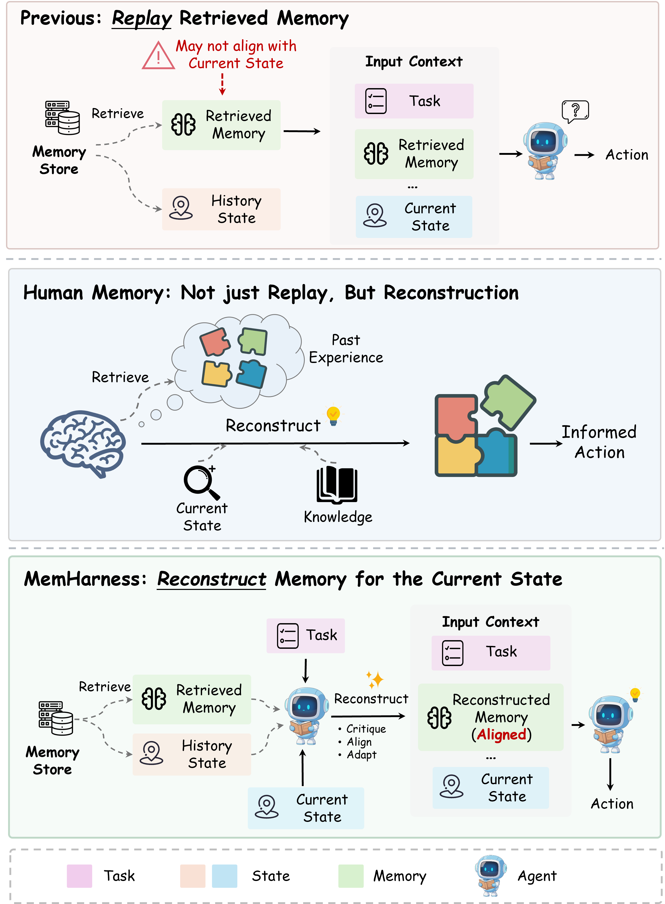
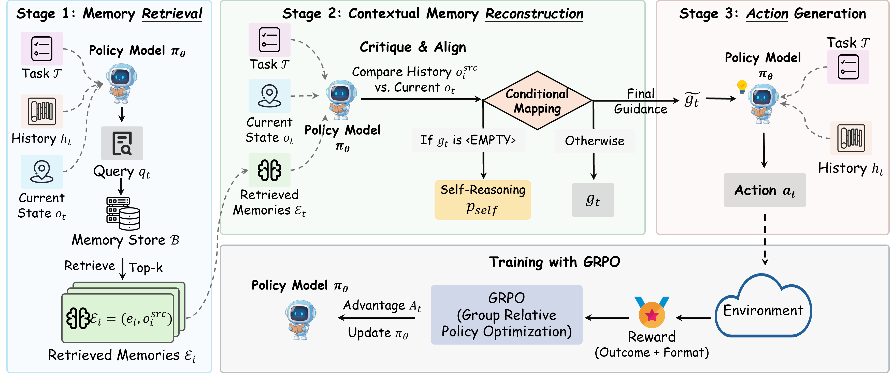
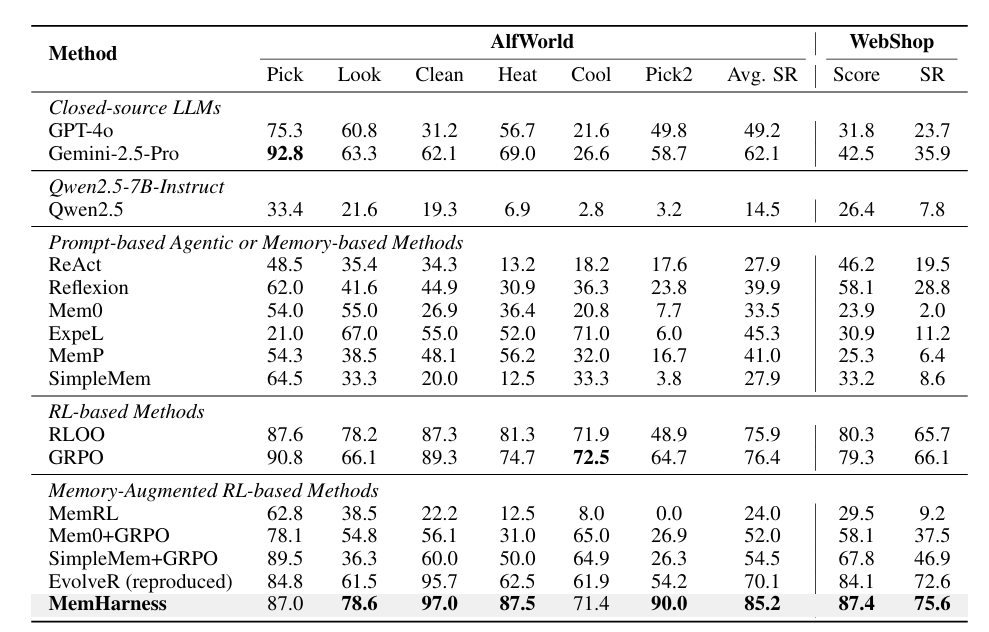
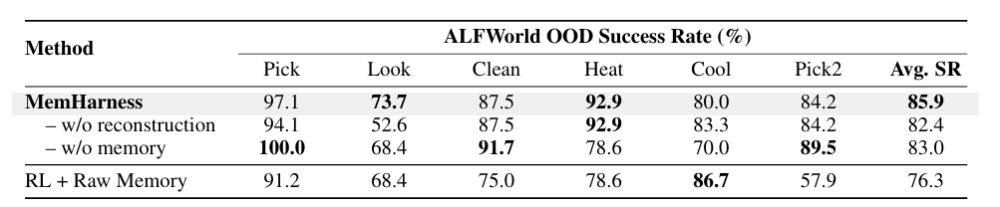

<div align="center">

# 🧠 MemHarness: Memory Is Reconstructed, Not Replayed

[](https://arxiv.org/abs/2607.28272)
[](https://huggingface.co/papers/2607.28272)
[](https://huggingface.co/KnowledgeXLab/MemHarness)
[](https://huggingface.co/datasets/KnowledgeXLab/MemHarness)
[](https://opensource.org/licenses/MIT)

**[ arXiv](https://arxiv.org/abs/2607.28272)** · **[ alphaXiv](https://www.alphaxiv.org/abs/2607.28272)** · **[🤗 Paper](https://huggingface.co/papers/2607.28272)** · **[Models](https://huggingface.co/KnowledgeXLab/MemHarness)** · **[ Dataset](https://huggingface.co/datasets/KnowledgeXLab/MemHarness)** · **[Model Zoo](#-model-zoo)**

</div>

---

**MemHarness** is a framework that equips LLM agents to **actively harness and reconstruct past experiences** based on the present context — instead of replaying retrieved memories verbatim.

Most memory-augmented agents treat retrieved experiences as static records and inject them into the context regardless of whether they align with the agent's current situation. This *"replay"* paradigm ignores the gap between the abstract, general nature of stored experience and the concrete, ever-changing states at decision time, frequently causing **negative transfer**.

Inspired by the reconstructive nature of human memory, MemHarness decomposes memory-guided decision-making into five stages — **observation → retrieval → critique → reconstruction → action**. At each decision step, a unified policy model critiques the retrieved experience against its original context, reconstructs it into state-aligned guidance, and only then acts. This reconstructive ability requires no extra human annotation — it emerges naturally through **end-to-end training with GRPO**.

<p align="center">
  
  <br>
  <em>Figure 1: Memory utilization paradigms. Top: prior methods directly replay retrieved memories, risking state
  misalignment. Middle: human memory reconstructs past experience according to the current context.
  Bottom: MemHarness reconstructs retrieved memories into state-aligned guidance.</em>
</p>

## 📰 Updates

- **`2026-08-07`**: 🤗 Cold-start SFT data released on [Hugging Face Datasets](https://huggingface.co/datasets/KnowledgeXLab/MemHarness).
- **`2026-07-31`**: 🤗 Model weights (cold-start & GRPO-trained) are available on [Hugging Face](https://huggingface.co/KnowledgeXLab/MemHarness).
- **`2026-07-30`**: 📄 Paper is publicly available on [arXiv](https://arxiv.org/abs/2607.28272).
- **`2026-07-30`**: 🎉 Codebase is publicly available.

## ✨ Highlights

- 🔄 **Reconstruct, not replay** — explicit critique and reconstruction are inserted between retrieval and action, turning memory from a static prompt fragment into context-sensitive guidance.
- 🚀 **Substantial gains** — **85.2%** success rate on ALFWorld and **75.6%** on WebShop, outperforming pure GRPO by **+8.8% / +9.5%**, and surpassing Gemini-2.5-Pro by **+23.1% / +39.7%** despite the 7B scale.
- 🛡️ **OOD robustness** — **85.9%** average success rate on unseen ALFWorld layouts, vs. 76.3% for naive memory replay.
- 🧩 **Latent guidance** — the reconstruction objective improves the policy even when memory is disabled at test time (83.0% vs. 76.4% for pure GRPO on ALFWorld), fundamentally enhancing the agent's intrinsic reasoning capabilities.

## 🏗️ Method Overview

<p align="center">
  
  <br>
  <em>Figure 2: Overview of MemHarness. The execution pipeline consists of three stages: (1) Memory Retrieval,
  where the policy generates a query to fetch relevant past experiences; (2) Contextual Memory Reconstruction,
  where the policy compares the memory's source state with the current state to reconstruct adapted guidance
  (or falls back to self-reasoning if the memory is deemed unhelpful); and (3) Action Generation guided by the
  reconstructed memory.</em>
</p>

MemHarness maintains an explicit, inspectable memory bank while parameterizing state-conditioned reconstruction within a single policy:

1. **Retrieve** — the agent generates a query and pulls the top-k relevant experiences (each paired with its historical source observation) from a Milvus vector memory bank.
2. **Critique & Reconstruct** — conditioned on the current state, the policy compares the memory's source state with the present situation, then rewrites it into state-specific guidance — or rejects it and falls back to self-reasoning.
3. **Act** — the agent takes environment actions informed by the reconstructed guidance.
4. **Write back & prune** — after each episode, experiences are summarized from the trajectory, written back to the memory bank with semantic deduplication, and periodically pruned by empirical utility.

All of this is trained end-to-end with **GRPO** on top of the [verl-agent](https://github.com/langfengQ/verl-agent) infrastructure.

## 🎯 Getting Started

### Installation

We recommend using Conda for environment management. The setup follows [verl-agent](https://github.com/langfengQ/verl-agent), with an additional Milvus vector database for the memory bank.

#### 1. Create the Training Environment

```bash
# 1. Clone the repository
git clone https://github.com/KnowledgeXLab/MemHarness.git
cd MemHarness

# 2. Create and activate conda environment
conda create -n memharness python==3.12 -y
conda activate memharness

# 3. Install vLLM
pip3 install vllm==0.8.4

# 4. Install Flash Attention 2
pip3 install flash-attn --no-build-isolation --no-cache-dir

# 5. Install MemHarness (verl-based trainer + agent system)
#    This also installs pymilvus — Milvus Lite runs locally as the memory vector database.
pip install -e .

# 6. Experiment tracking
pip install wandb
```

#### 2. Install the ALFWorld Environment

Clone the `memharness` environment into a dedicated ALFWorld environment, then install ALFWorld on top:

```bash
conda create -n memharness-alfworld --clone memharness
conda activate memharness-alfworld

pip3 install gymnasium==0.29.1
pip3 install stable-baselines3==2.6.0
pip install alfworld

# Download PDDL & game files and the pre-trained MaskRCNN detector (stored in ~/.cache/alfworld/)
alfworld-download -f
```

#### 3. Install the WebShop Environment

Similarly, clone the `memharness` environment for WebShop:

```bash
conda create -n memharness-webshop --clone memharness
conda activate memharness-webshop

cd ./agent_system/environments/env_package/webshop/webshop
./setup.sh -d all
```

> WebShop upstream recommends Python ≤ 3.10. If `./setup.sh` fails in the cloned environment, create a fresh `python==3.10` environment and reinstall MemHarness instead (see [verl-agent](https://github.com/langfengQ/verl-agent#2-webshop)).

> If you encounter issues with `gdown`, visit `https://drive.google.com/`, get your Google Drive cookie, and paste it into `.cache/gdown/cookies.txt`, or download the files manually.

#### 4. Deploy the Embedding Server

The memory bank embeds experiences with [BGE-M3](https://huggingface.co/BAAI/bge-m3) through an OpenAI-compatible API. The simplest option is to serve it with vLLM:

```bash
vllm serve BAAI/bge-m3 --port 8001
```

Then point the training scripts to it via `EMBEDDING_API_URL` (default: `http://localhost:8001/v1`).

### 🗄️ Data Preparation

Following verl-agent, the training data for ALFWorld / WebShop only acts as a modality & size indicator — the actual agent input comes from the environment through `env.step()`. The training scripts run the preparation step automatically; you can also run it manually:

```bash
# ALFWorld
python3 -m examples.data_preprocess.prepare \
  --mode text --local_dir data/MemHarness/verl-agent/alfworld --infer_alfworld_sizes \
  --alfworld_eval_split eval_in_distribution

# WebShop
python3 -m examples.data_preprocess.prepare \
  --mode text --local_dir data/MemHarness/verl-agent/webshop --infer_webshop_sizes
```

By default the training scripts expect data under `data/MemHarness/verl-agent/{alfworld,webshop}/text/` (`train.parquet` / `test.parquet`). You can adjust `setup_verl_agent_text_data_paths` in `run_scripts/memory_eval_helpers.sh` to point to your own location.

## 🚀 Training

MemHarness training consists of two stages:

### Stage 1 — Cold-Start SFT (optional but recommended)

A brief cold-start stage aligns the base model with the MemHarness interaction format before GRPO training. **For convenience, we also release cold-start model checkpoints on [Hugging Face](https://huggingface.co/KnowledgeXLab/MemHarness)** — you can skip this stage and use them directly as `MODEL_PATH` in Stage 2.

Cold-start data (200 train + 20 val samples per benchmark, plus GPT-5.1 teacher memory records) is available on **[KnowledgeXLab/MemHarness](https://huggingface.co/datasets/KnowledgeXLab/MemHarness)**. Download and place under `data/MemHarness/`:

```
data/MemHarness/cold_start/
├── alfworld/
│   ├── train.parquet
│   ├── val.parquet
│   └── memory_records-gpt-5.1.jsonl
└── webshop/
    ├── train.parquet
    ├── val.parquet
    └── memory_records-gpt-5.1.jsonl
```

```bash
huggingface-cli download KnowledgeXLab/MemHarness --repo-type dataset --local-dir data/MemHarness
```

Then run SFT (set `TASK=alfworld` or `TASK=webshop`):

```bash
TASK=alfworld bash scripts/cold_start_sft.sh
```

### Stage 2 — GRPO Training with Memory Reconstruction

```bash
# ALFWorld
bash run_scripts/train_alfworld.sh

# WebShop
bash run_scripts/train_webshop.sh
```

The scripts handle everything end-to-end: launching the memory vector database (locally, or on a Slurm cluster via `MEMORY_REMOTE_SLURM=True`), agentic memory retrieval, experience summarization / write-back / utility pruning, and GRPO training with format rewards.

Key configuration knobs in the training scripts (all overridable via environment variables):

| Variable | Description | Default |
| --- | --- | --- |
| `MODEL_PATH` | Policy initialization (cold-start checkpoint or base model) | cold-start checkpoint |
| `EMBEDDING_API_URL` | OpenAI-compatible embedding API for the memory bank | `http://localhost:8001/v1` |
| `MEMORY_ENABLED` | Enable the memory bank | `True` |
| `MEMORY_WRITE_BACK` | Write summarized experiences back after episodes | `True` |
| `RETRIEVAL_MODE` | `agentic` (model decides when to retrieve) or `fixed` | `agentic` |
| `EXPERIENCE_SUMMARIZER_MODE` | `none` / `self` / `teacher` distillation | `self` |
| `EXPERIENCE_UTILITY_ENABLE` | Periodically prune low-utility memories | `True` |
| `MEMORY_REMOTE_SLURM` | Launch the memory VDB server on a Slurm cluster | `False` |
| `reward_model.format_reward.*` | Format reward encouraging retrieval + reconstruction | enabled |

## 📈 Results

<p align="center">
  
  <br>
  <em>Figure 3: Main results on ALFWorld and WebShop. MemHarness achieves the best performance (85.2% / 75.6%
  average success rate), outperforming pure RL and static memory-augmented baselines. Naively injecting raw
  memory on top of RL degrades performance, while state-conditioned reconstruction safely leverages experience.</em>
</p>

<p align="center">
  
  <br>
  <em>Figure 4: Out-of-distribution generalization on ALFWorld with unseen layouts and object placements.
  Verbatim replay introduces state-mismatch noise, whereas MemHarness dynamically filters and rewrites
  mismatched guidance, achieving the highest average success rate (85.9%).</em>
</p>

Please refer to our [paper](https://arxiv.org/abs/2607.28272) for ablations, mechanism analyses, and training dynamics.

## 📂 Repository Structure

```
MemHarness/
├── agent_system/           # Agent environments & memory system
│   ├── environments/       # ALFWorld, WebShop, Search, etc.
│   └── memory/             # Memory bank (Milvus), summarizer, retriever, utility pruning
├── verl/                   # RL training infrastructure (GRPO, based on verl & verl-agent)
├── run_scripts/            # GRPO training & evaluation scripts
├── scripts/                # Cold-start data building & SFT scripts
├── examples/               # Data preprocessing
└── tests/                  # Unit & e2e tests
```

## 🤗 Model Zoo

All model weights are hosted on the Hugging Face Hub at **[KnowledgeXLab/MemHarness](https://huggingface.co/KnowledgeXLab/MemHarness)**.

### Cold-Start Models (SFT)

These checkpoints align the base model with the MemHarness interaction format before GRPO training. **You can use them directly** as `MODEL_PATH` in `run_scripts/train_alfworld.sh` / `train_webshop.sh` without running cold-start SFT.

| Checkpoint | Base Architecture | Params | Hugging Face |
| --- | --- | --- | --- |
| Cold-Start (ALFWorld-7B) | Qwen2.5-7B-Instruct | 7B | [MemHarness](https://huggingface.co/KnowledgeXLab/MemHarness) |
| Cold-Start (WebShop-7B) | Qwen2.5-7B-Instruct | 7B | [MemHarness](https://huggingface.co/KnowledgeXLab/MemHarness) |

### GRPO-Trained Models

| Checkpoint | Base Architecture | Params | Hugging Face |
| --- | --- | --- | --- |
| MemHarness (ALFWorld-7B) | Qwen2.5-7B-Instruct | 7B | [MemHarness](https://huggingface.co/KnowledgeXLab/MemHarness) |
| MemHarness (WebShop-7B) | Qwen2.5-7B-Instruct | 7B | [MemHarness](https://huggingface.co/KnowledgeXLab/MemHarness) |

Download the desired checkpoint from the [Files](https://huggingface.co/KnowledgeXLab/MemHarness/tree/main) tab and set `MODEL_PATH` in the training scripts accordingly.

## 🔗 Related Projects

- [EvolveR](https://github.com/KnowledgeXLab/EvolveR) — our prior work on self-evolving LLM agents through an experience-driven lifecycle (ICML 2026).

## 🙏 Acknowledgements

MemHarness is built upon [verl-agent](https://github.com/langfengQ/verl-agent) and [verl](https://github.com/volcengine/verl), with [vLLM](https://github.com/vllm-project/vllm) for efficient rollout and model serving. The supported environments are adapted from [ALFWorld](https://github.com/alfworld/alfworld) and [WebShop](https://github.com/princeton-nlp/WebShop). The base trajectories (without memory) used to build our cold-start data are sourced from the open-source [AgentGym](https://github.com/WooooDyy/AgentGym) project. We thank the authors and contributors of these projects for their valuable open-source work.

## 📬 Contact

For any questions or feedback, please:

- Open an issue in this GitHub repository
- Reach out to us at wurong1159@zju.edu.cn

## 📜 Citation

If you find our paper and code useful, please kindly cite us:

```bibtex
@misc{wu2026memharnessmemoryreconstructedreplayed,
      title={MemHarness: Memory Is Reconstructed, Not Replayed}, 
      author={Rong Wu and Daocheng Fu and Licheng Wen and Xuemeng Yang and Shu Zou and Jianbiao Mei and Yuxin Wang and Hairong Zhang and Yu Yang and Tao Hu and Cong Zhang and Botian Shi and Pinlong Cai},
      year={2026},
      eprint={2607.28272},
      archivePrefix={arXiv},
      primaryClass={cs.AI},
      url={https://arxiv.org/abs/2607.28272}, 
}
```
